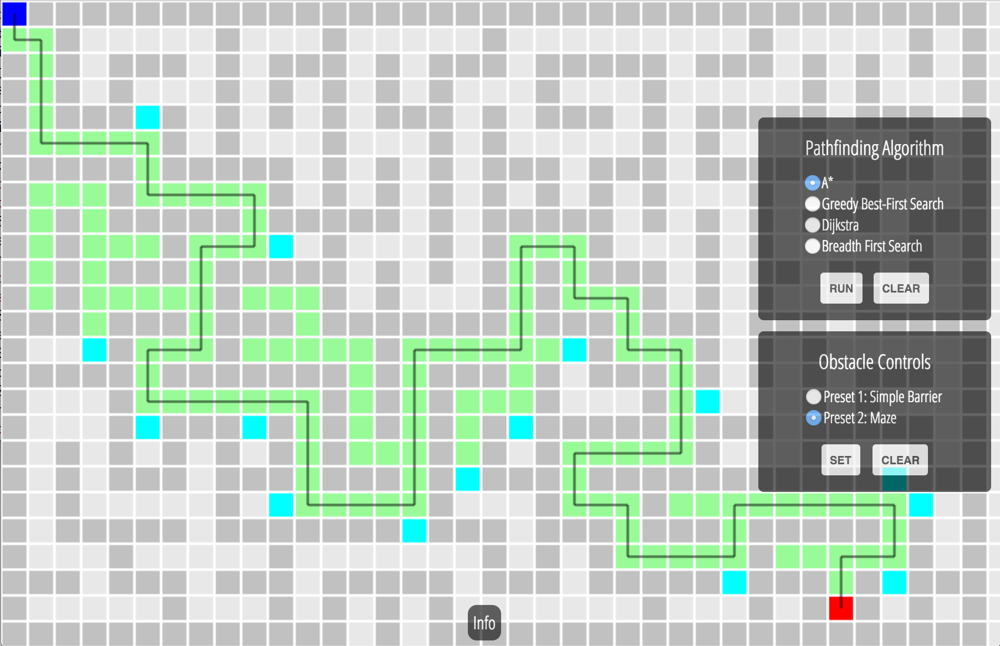
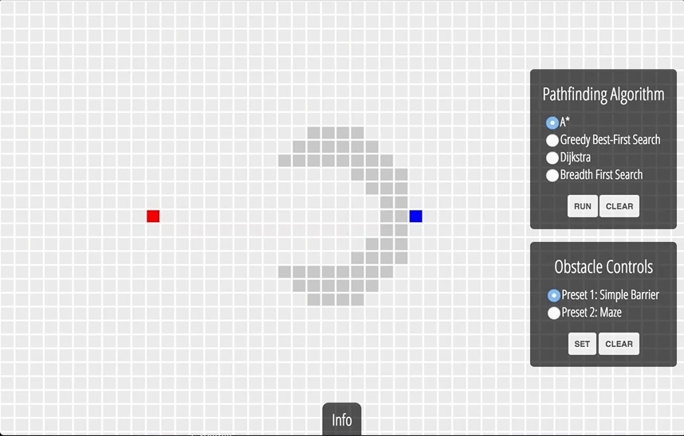
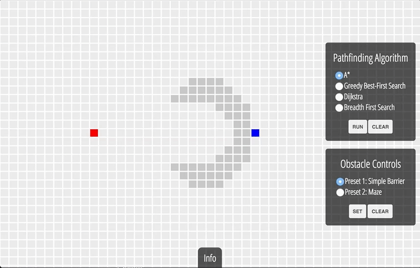
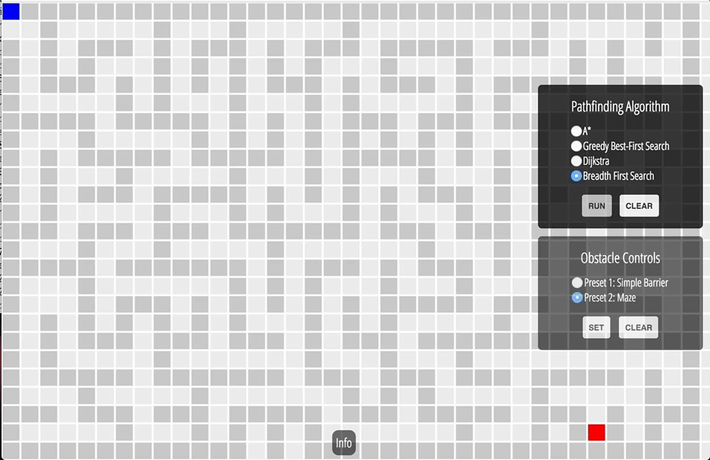

# Pathfinder.js: A Pathfinding Algorithm Visualizer

[Live Link](https://ndshal.github.io/pathfinder.js)

## Background
Pathfinding comes up in a variety of contexts, from role-playing games to ride-sharing apps.
The basic setup is as follows: given a graph (a list of connected nodes), a
starting node and a goal node, we want to find the shortest path from the start
to the goal.

Pathfinder.js is an interactive visualization tool that aims to demonstrate
functionality and efficiency of four such algorithms:
  * Breadth First Search:
  * Dijkstra's Algorithm:
  * Greedy Best-First Search:
  * A\* Algorithm

The project was built in four days with:
  * Vanilla JavaScript
  * [EaselJS][easel] for the visualizations
  * [jQuery][jquery] for DOM manipulation

[easel]: http://www.createjs.com/easeljs
[jquery]: https://jquery.com/

## Features

### Interactive and Customizable Grid
Pathfinder.js demonstrates four pathfinding algorithms in an interactive,
customizable way. The start and goal squares are draggable to anywhere on
the full-screen grid and obstacles are easily painted on with the mouse.
Control panels let you choose which search algorithm to run, as well as clear
a previous or current search.


### Obstacle Presets
Don't want to draw your own obstacles? Pathfinder.js comes with 2 preset
obstacle courses - one is a simple barrier between the start and goal
and the other a fleshed out maze.

Simple Barrier             |  Maze
:-------------------------:|:-------------------------:
  |  

### Functional, Efficiently Implemented, Algorithms
The pathfinding grid can be represented by a graph - a set of vertices (the squares)
and edges (the paths between them).

All four of the pathfinding algorithms have the same components:
  * Start and goal nodes
  * The **frontier** - a list of nodes currently queued for exploration (colored light blue)
  * A list of **visited** nodes (colored green)
  * The **path**, or list of edges from start to goal

A generic search, regardless of algorithm, proceeds as follows:
  1. From the start node, find all the neighbors, add those to the **frontier**
  2. For each node in the **frontier**, add its neighbors to the **frontier**, and mark this
    current node as **visited**
  3. Once the goal is **visited**, build a path through visited nodes

Where the algorithms differ is how nodes in the frontier are prioritized - visually
this corresponds to how fast, and in what direction, the frontier expands.

#### Breadth First Search
Breadth First Search (BFS) treats all elements in the frontier equally,
and visits all neighbors of the start before moving on. This results in a frontier that
expands expands out equally in all directions. BFS is brute force approach - expanding in all
directions will always find the path, but the entire grid may need to be explored before this happens.

#### Dijkstra's Algorithm
Dijkstra's algorithm is similar to BFS in the sense that the frontier expands in all directions.
However, Dijkstra introduces the concept of **cost** to deal with obstacles. Moving through obstacle
nodes has a high cost, and Dijkstra minimizes cost by preferring to explore around obstacles.

**Note:** Because the cost of obstacles is not infinite, when there is no other option the Dijkstra path
will actually move through an obstacle, whereas BFS will just get stuck.

In Dijkstra's Algorithm, the frontier is a PriorityQueue data structure, built on MinHeap.
```js
//dijkstra.js

processNeighbors(current) {
  this.board.neighbors(current).forEach(
    function(neighbor) {
      const type = this.board.grid[neighbor].type;
      const cost = type === 'obstacle' ? 100 : 1;
      const newCost = this.costSoFar[current] + cost;

      if (!(neighbor in this.costSoFar) ||
          newCost < this.costSoFar[neighbor]) {
          this.frontier.insert(neighbor, newCost);
          // use cost as the priority in the PriorityQueue, higher cost
          // paths are processed later
          this.cameFrom[neighbor] = current;
          this.costSoFar[neighbor] = newCost;
          this.board.grid[neighbor].setType('frontier');
        }
      }.bind(this)
    );
}
```

#### Greedy Best-First Search
Greedy Best-First Search is greedy in the sense that it moves directly toward the goal.
Regardless of obstacles, Best-First Search will always try to minimize the remaining distance to the goal.
Compared to BFS and Dijkstra, Best-First does not explore equally in all directions, and is significantly faster.

#### A\*
A drawback of Best-First Search is that when there are obstacles between the start and the goal, Best-First
can get 'tangled' in the obstacles, and the final path will be longer than necessary. Enter A\*.

A\* accounts for the cost of obstacles like Dijkstra's Algorithm, while still minimizing distance to the goal. The result is an efficient algorithm that both explores in the correct direction (like best-first), and intelligently avoids obstacles (like Dijkstra). This balance is what makes A\* a standard choice for
real world pathfinding problems.

```js
//a_star.js

processNeighbors(current) {
  this.board.neighbors(current).forEach(
    function(neighbor) {
      const type = this.board.grid[neighbor].type;
      const cost = type === 'obstacle' ? 100 : 1;
      const newCost = this.costSoFar[current] + cost;

      if (!(neighbor in this.costSoFar) ||
          newCost < this.costSoFar[neighbor]) {
            const priority = newCost + this.euclidean(neighbor, this.board.goal);
            // combine euclidean distance to goal and cost

            this.frontier.insert(neighbor, priority);
            this.cameFrom[neighbor] = current;
            this.costSoFar[neighbor] = newCost;
            this.board.grid[neighbor].setType('frontier');
        }
      }.bind(this)
    );
}
```

#### Comparing A\* and Greedy Best-First Search on the Simply Barrier
Best-First Search            |  A\* Algorithm
:-------------------------:|:-------------------------:
 | 

Both algorithms prioritize movement toward the goal and then explore, but the final path of Best-First is longer.

#### Comparing A\* and BFS on the Maze
Breadth First Search           |  A\* Algorithm
:-------------------------:|:-------------------------:
 | 

BFS explores the many corners of the maze, while A\* moves straight toward the goal. Note that both
algorithms come up with the same final path - BFS is still correct, A\* is just more efficient.

## Future Directions
Some future ideas for Pathfinder.js include:
 * UX improvements
 * More search algorithms and obstacle Presets
 * An entirely new module that generates mazes procedurally
